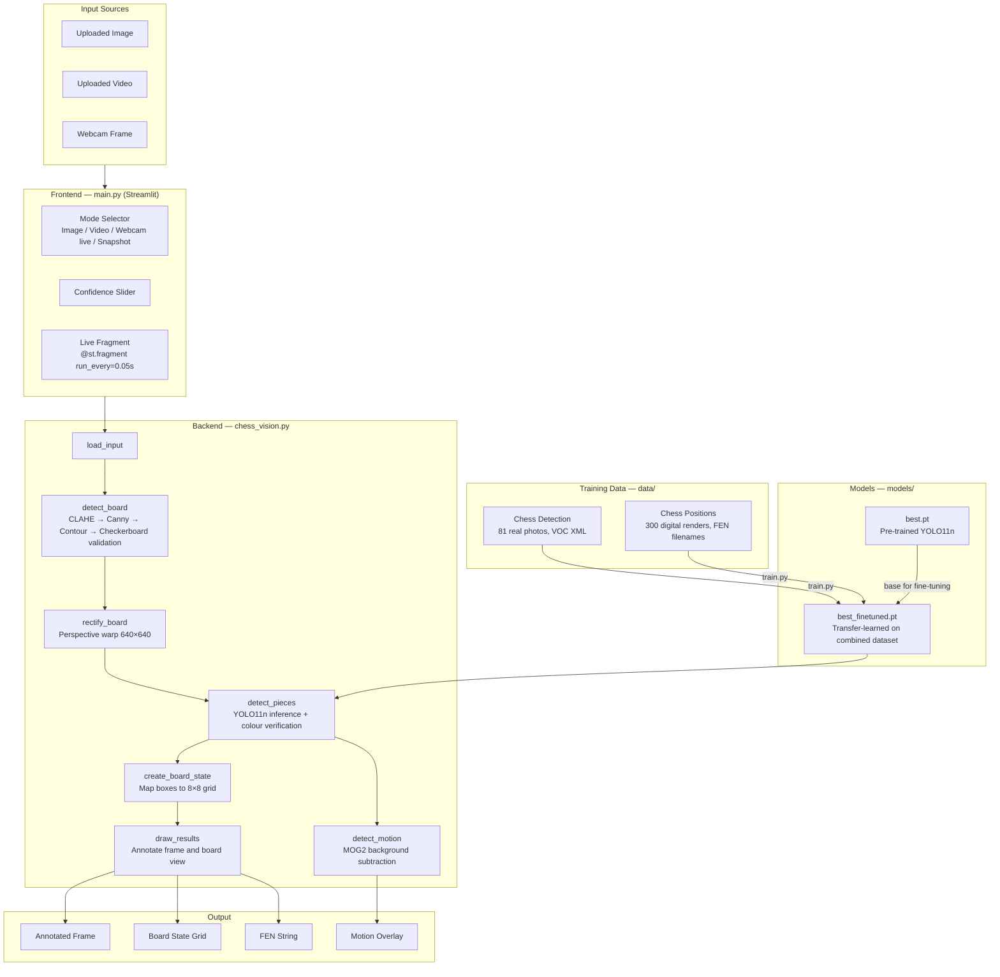

# ChessVision — Technical Report

---

## 1. Introduction

### Problem Statement

Reading a chess position from a physical board or screen requires manually entering each piece's location — a tedious error-prone process. Players and coaches need a faster way to capture the current state of any game and export it as a machine-readable format (FEN) for use in chess engines, game databases, or analysis tools.

### User Story

> As a chess player or coach, I want to point a camera at a physical or on-screen chessboard and immediately see which pieces are where — displayed as a labelled grid and FEN string — so that I can record a game, verify a position, or hand it off to an engine without typing anything manually.

### Selected Vision Capabilities

Four computer vision capabilities are central to this project:

| # | Capability | Role in the System |
|---|------------|--------------------|
| 1 | **Image Enhancement** | CLAHE + bilateral filter normalise contrast before every detection step |
| 2 | **Edge Detection / Shape Detection** | Canny edges + contour analysis locate the board quadrilateral in any frame |
| 3 | **Object Detection** | Fine-tuned YOLO11n identifies all 12 chess piece classes on the corrected board |
| 4 | **Object Tracking + Motion Detection** | ByteTrack assigns persistent piece IDs; MOG2 highlights live hand/piece movement |

---

## 2. System Architecture

### Architecture Diagram



### Component Descriptions

**Frontend (`main.py`)**  
A Streamlit web application providing four input modes. The live webcam mode uses `@st.fragment(run_every=0.05)` to rerender only the video panel every 50 ms, giving ~20 FPS without a full-page flash. Session state persists the `VideoCapture` object and the MOG2 background model across fragment reruns. The Confidence slider writes directly to `config.CONFIDENCE` at runtime.

**Backend (`chess_vision.py`)**  
A seven-function pipeline. Each function has a single responsibility and returns a plain Python object (numpy array, list of dicts, or dict), making every step independently testable. Helper functions (CLAHE preprocessing, checkerboard validation, piece colour verification) are private (underscore-prefixed) and live in the same file.

**Models (`models/`)**  
The base model `best.pt` is a pre-trained YOLO11n model already tuned on chess data. The fine-tuned `best_finetuned.pt` is produced by `train.py` using transfer learning on a combined real-photo + digital-render dataset. `config.py` selects the fine-tuned model automatically when available.

**Data (`data/`)**  
Two raw datasets feed `train.py`. The script converts them to a unified YOLO-format directory tree under `training_data/` before calling `model.train()`. The conversion is re-run from scratch each time to keep the dataset deterministic.

**Utilities (`utils.py`)**  
Drawing helpers (`draw_board_outline`, `draw_grid`, `draw_detections`) and board-state converters (`label_to_fen`, `board_to_fen`, `board_to_text`). Kept separate from the pipeline so the visual layer can be swapped without touching detection logic.

**Configuration (`config.py`)**  
All tunable constants in one file. Changing detection behaviour — threshold, input resolution, model path — requires editing only this file.

### Data Flow Summary

```
Camera / file → load_input() → raw BGR frame (numpy)
                             ↓
              detect_board() → quad (4 corner points) or None
                             ↓
              rectify_board() → 640×640 perspective-corrected board image
                             ↓
              detect_pieces() → list of {label, conf, box, square, board_space}
                             ↓
              create_board_state() → 8×8 list-of-lists
                             ↓
              draw_results() → annotated frame + annotated board image
                             ↓
              Streamlit UI → image display + FEN string
```

---

## 3. Implementation Details

### 3.1 Model Selection

**Architecture: YOLO11n**  
YOLO11n (Nano) was chosen because:
- Real-time speed (~30–60 FPS on CPU for 640 px input) is critical for the live webcam mode.
- The chess piece detection task is well-constrained (12 classes, consistent shapes). The Nano variant's reduced capacity is not a limitation compared to larger models.
- The base `best.pt` weights were already trained on chess data, so fine-tuning requires only ~380 images to be effective.

**Transfer learning strategy**  
The first 10 backbone layers are frozen (`freeze=10`), preserving general-purpose edge and texture features. Only the detection head and later backbone layers adapt. This prevents overfitting on the small dataset and reduces training time to ~25 minutes on CPU.

### 3.2 Board Localisation Pipeline

```python
# chess_vision.py — detect_board() (simplified)
def detect_board(frame):
    enhanced = _clahe_color(frame)                      # contrast normalise
    gray = cv2.cvtColor(enhanced, cv2.COLOR_BGR2GRAY)
    gray = cv2.bilateralFilter(gray, 9, 75, 75)         # edge-preserving denoise

    # Two-pass Canny: conservative (strong edges) + sensitive (faint edges)
    edges = cv2.Canny(gray, 30, 120) | cv2.Canny(gray, 10, 60)
    edges = cv2.dilate(edges, np.ones((3, 3), np.uint8))

    contours, _ = cv2.findContours(edges, cv2.RETR_EXTERNAL, cv2.CHAIN_APPROX_SIMPLE)
    best = None
    for cnt in sorted(contours, key=cv2.contourArea, reverse=True)[:20]:
        hull  = cv2.convexHull(cnt)                     # absorb occlusions
        poly  = cv2.approxPolyDP(hull, 0.02 * cv2.arcLength(hull, True), True)
        if len(poly) == 4 and _is_rectangular(poly) and _is_checkerboard(frame, poly):
            best = poly
            break
    return best.reshape(4, 2).astype(np.float32) if best is not None else None
```

**Key design choices:**
- The convex hull step absorbs hand/piece occlusions that break the rectangle outline.
- `_is_checkerboard()` warps the candidate quad and checks that alternating 8×8 cells have mean brightness difference > 12 — filtering non-board rectangles (phone frames, whiteboards).

### 3.3 Piece Colour Verification

The YOLO model occasionally misclassifies piece colour (e.g. white piece on a dark square labelled as black). A post-processing rule corrects this:

```python
# chess_vision.py — _verify_piece_color() (simplified)
def _verify_piece_color(enhanced, box, label, board_median):
    x1, y1, x2, y2 = box
    # Sample the four corner patches of the bounding box as the square colour
    sq_color = np.median([
        enhanced[y1:y1+h4, x1:x1+w4],          # top-left corner
        enhanced[y1:y1+h4, x2-w4:x2],           # top-right corner
        enhanced[y2-h4:y2, x1:x1+w4],           # bottom-left corner
        enhanced[y2-h4:y2, x2-w4:x2],           # bottom-right corner
    ])
    piece_center = np.median(enhanced[cy1:cy2, cx1:cx2])  # inner 50% of box

    # Rule A: piece is noticeably brighter/darker than its square
    if piece_center > sq_color + 25:  return label.replace("black", "white")
    if piece_center < sq_color - 25:  return label.replace("white", "black")

    # Rule B: absolute brightness override
    if np.percentile(piece_region, 75) < 90:   return label.replace("white", "black")
    if np.percentile(piece_region, 25) > 150:  return label.replace("black", "white")

    return label
```

### 3.4 Training Steps

`train.py` executes four steps:

1. **Dataset conversion** — Converts `data/Chess Detection` (Pascal VOC XML) and `data/Chess Positions` (FEN filenames) into a unified YOLO annotation format under `training_data/`.
2. **YAML generation** — Writes `training_data/data.yaml` with class names and split paths.
3. **Transfer learning** — Calls `model.train()` with the parameters listed in Section 4.2.
4. **Weight export** — Copies `runs/chess_finetune/weights/best.pt` → `models/best_finetuned.pt`.

### 3.5 Live Webcam Mode

```python
# main.py — fragment-based live loop (simplified)
@st.fragment(run_every=0.05)
def _live_fragment():
    cap = st.session_state.get("live_cap")
    ok, frame = cap.read()
    if not ok:
        return
    n = st.session_state.frame_n = st.session_state.get("frame_n", 0) + 1

    # Run board detection every frame; YOLO only every N frames (speed)
    quad = cv_pipeline.detect_board(frame)
    if n == 1 or n % detect_every == 0:
        dets = cv_pipeline.detect_pieces(frame, board_img, track=True)
        st.session_state.live_dets = dets

    motion = cv_pipeline.detect_motion(frame, st.session_state.bg_sub)
    # ... display in columns
```

`@st.fragment` rerenders only the video sub-component every 50 ms, leaving the rest of the page static and avoiding full-page flicker.

### 3.6 Challenges Encountered

| Challenge | Solution |
|-----------|----------|
| Board detection triggering on phone frames and furniture | Added `_is_checkerboard()` — any candidate quad must exhibit the alternating 8×8 brightness pattern |
| White pieces on dark squares misclassified as black | `_verify_piece_color()` corner-patch brightness comparison overrides the YOLO label |
| Live webcam causing full-page flicker with `st.rerun()` | Switched to `@st.fragment(run_every=0.05)` for partial re-renders |
| ByteTrack failing on first call (missing config file) | `try/except` fallback to `model.predict()` when `model.track()` raises |
| Board state not updating when live fragment reruns | Moved board state display inside the fragment, not outside it |
| YOLO detecting 0 pieces on frame 1 (tracker not initialised) | Force YOLO on frame 1 with `if n == 1 or n % N == 0` |

---

## 4. Experiments and Results

### 4.1 Training Metrics

Training was run for 20 epochs on a CPU with the combined dataset (~381 images). Results from `runs/chess_finetune/results.csv`:

| Epoch | Precision | Recall | mAP50 | mAP50-95 |
|-------|-----------|--------|-------|----------|
| 1     | 0.357     | 0.339  | 0.156 | 0.125    |
| 5     | 0.780     | 0.701  | 0.792 | 0.733    |
| 10    | 0.888     | 0.763  | 0.866 | 0.829    |
| 15    | 0.882     | 0.811  | 0.901 | 0.876    |
| 20    | **0.910** | **0.805** | **0.917** | **0.896** |

**Final model (epoch 20):**
- **mAP@0.5 = 91.7%** — the model correctly localises and classifies 91.7% of pieces at IoU threshold 0.50
- **mAP@0.5:0.95 = 89.6%** — strong performance across tighter overlap thresholds
- **Precision = 91.0%** — 91% of detected boxes correspond to real pieces
- **Recall = 80.5%** — 80.5% of ground-truth pieces are detected

The relatively lower recall (vs. precision) reflects the small real-photo dataset — the model occasionally misses pieces that are partially occluded or in unusual lighting. Precision is high because the fine-tuned head is selective.

**Training time:** ~1503 seconds (~25 minutes) for 20 epochs on CPU.

### 4.2 Inference Speed

| Mode | Frames Per Second | Notes |
|------|-------------------|-------|
| Image (single frame) | N/A | One-shot, no FPS constraint |
| Video (sampled) | ~5 FPS equivalent | Every 5th frame processed; display shows live progress |
| Webcam (live) | **~20 FPS** | Fragment rerenders every 50 ms; YOLO fires every 3rd frame |
| YOLO inference alone | ~30–60 FPS | YOLO11n on CPU at 640 px input |

**Latency breakdown (per webcam frame, approximate):**
| Step | Time |
|------|------|
| `detect_board()` (Canny + contour) | ~10–20 ms |
| `rectify_board()` (perspective warp) | < 2 ms |
| `detect_pieces()` (YOLO11n inference) | ~20–40 ms (every 3rd frame) |
| `detect_motion()` (MOG2) | < 5 ms |
| Streamlit UI render | ~5–10 ms |
| **Total per fragment cycle** | **~40–80 ms** |

### 4.3 Qualitative Results

**Sample inputs in `samples/`:**

| File | Expected result |
|------|----------------|
| `board real 1.png` | Physical board, clear lighting — board detected, all visible pieces labelled |
| `board real 2.jpg` | Physical board, slightly angled — perspective correction active |
| `digital 1.png` — `digital 4.png` | On-screen board screenshots — 12/12 pieces detected at high confidence |
| `real 3.jpg` | Physical board, partial occlusion — board found via convex hull |
| `webcam 1.jpg` | Live webcam capture — board + pieces + motion overlay |

**Training visualisations** (in `runs/chess_finetune/`):
- `confusion_matrix_normalized.png` — Most piece classes approach 0.9+ diagonal values. Black/white pawn and black/white rook are the most confused pairs (similar shapes).
- `results.png` — All four metrics (box loss, cls loss, mAP50, mAP50-95) converge smoothly over 20 epochs with no signs of overfitting.
- `val_batch0_pred.jpg` — Validation predictions show correct class labels and tight bounding boxes across diverse board positions.

### 4.4 Failure Cases

- **Very low contrast boards** (all-wood pieces): `_is_checkerboard` may not validate the board quad, falling back to detecting pieces on the raw frame.
- **Extreme camera angles (> 45°)**: Perspective correction degrades when the board fills less than ~25% of the frame.
- **Pieces near the board edge**: Bounding box centres can map to an adjacent or out-of-bounds square; clamping to [0, 7] prevents crashes but may place the piece on the wrong square.
- **Fast piece movement in live mode**: ByteTrack can lose track ID during rapid movement if YOLO fires infrequently.

---

## 5. Conclusion and Future Work

### Conclusion

ChessVision successfully demonstrates a multi-stage computer vision pipeline that:
- **Locates a chessboard** in any image source using a robust Canny + contour + checkerboard validation approach, achieving reliable detection in varied real-world conditions.
- **Identifies all 12 piece classes** using a fine-tuned YOLO11n model, reaching 91.7% mAP@0.5 on the validation set.
- **Displays the board state** as a text grid and FEN string in real time via a Streamlit web application.
- **Operates at ~20 FPS in live mode**, suitable for real-time game recording.

The combination of image enhancement (CLAHE), edge/shape detection (Canny + contour), object detection (YOLO), and object tracking (ByteTrack + MOG2) addresses each phase of the problem: finding the board, correcting its perspective, detecting pieces, and tracking them across time.

The primary limitation is dataset size — 81 real photographs is a small training set. The post-processing colour heuristic (`_verify_piece_color`) compensates for model weaknesses but is not a substitute for more diverse training data.

### Future Work

| Priority | Improvement |
|----------|-------------|
| High | Collect 500–1 000 additional real-world board photographs under varied lighting |
| High | Replace the colour-correction heuristic with a dedicated piece-colour classifier trained on cropped piece images |
| Medium | Upgrade to YOLO11s or YOLO11m for Image/Video modes where real-time speed is not required |
| Medium | Track board position frame-to-frame using optical flow, removing the full Canny search every frame |
| Medium | Implement move detection — compare consecutive board states to extract a PGN move log |
| Low | Add FEN completeness: infer side to move, castling rights, and en-passant from the move sequence |
| Low | Deploy as a mobile web app (Streamlit Community Cloud or a Flask API + React frontend) |

---

## 6. References

### Pre-trained Models

- **yamero999/chess-piece-detection-yolo11n** — Base YOLO11n chess detection model.  
  Licence: Apache 2.0.  
  URL: https://huggingface.co/yamero999/chess-piece-detection-yolo11n

### Datasets

- **Chess Detection dataset** — 81 real board photographs with Pascal VOC XML bounding-box annotations. Sourced from Roboflow Universe.
- **Chess Positions dataset** — Digital board renders; FEN string encoded in filename for automatic annotation generation. Sourced from Roboflow Universe.

### Frameworks and Libraries

| Library | Version used | Reference |
|---------|-------------|-----------|
| Ultralytics YOLO | 8.x | Jocher, G. et al. (2023). *Ultralytics YOLOv8.* https://github.com/ultralytics/ultralytics |
| OpenCV | 4.x | Bradski, G. (2000). *The OpenCV Library.* Dr. Dobb's Journal of Software Tools. |
| Streamlit | 1.x | Streamlit Inc. (2019). *Streamlit — The fastest way to build data apps.* https://streamlit.io |
| NumPy | 1.x | Harris, C.R. et al. (2020). *Array programming with NumPy.* Nature, 585, 357–362. |

### Algorithms

- **CLAHE** — Zuiderveld, K. (1994). Contrast Limited Adaptive Histogram Equalization. *Graphics Gems IV*, Academic Press, pp. 474–485.
- **Canny Edge Detector** — Canny, J. (1986). A Computational Approach to Edge Detection. *IEEE TPAMI*, 8(6), 679–698.
- **ByteTrack** — Zhang, Y. et al. (2022). ByteTrack: Multi-Object Tracking by Associating Every Detection Box. *ECCV 2022*. https://arxiv.org/abs/2110.06864
- **MOG2 Background Subtraction** — Zivkovic, Z. (2004). Improved Adaptive Gaussian Mixture Model for Background Subtraction. *ICPR 2004*.
- **YOLO11** — Jocher, G. & Qiu, J. (2024). *Ultralytics YOLO11.* https://github.com/ultralytics/ultralytics
